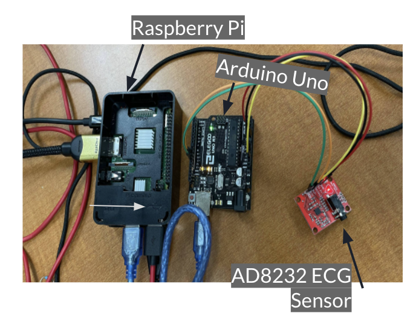
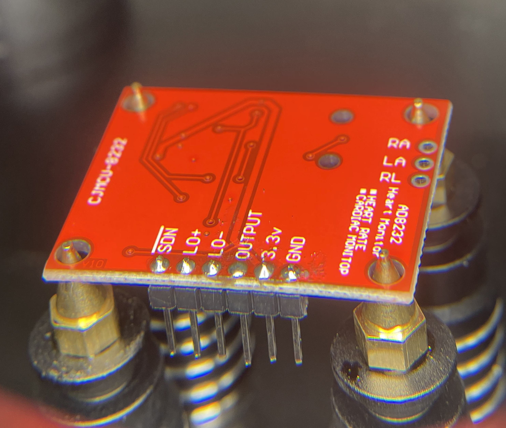
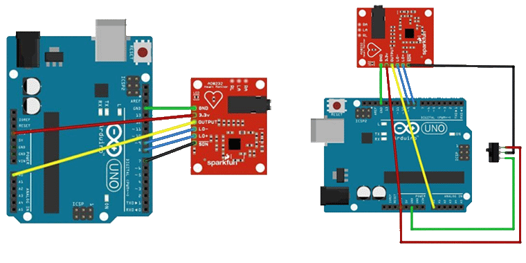
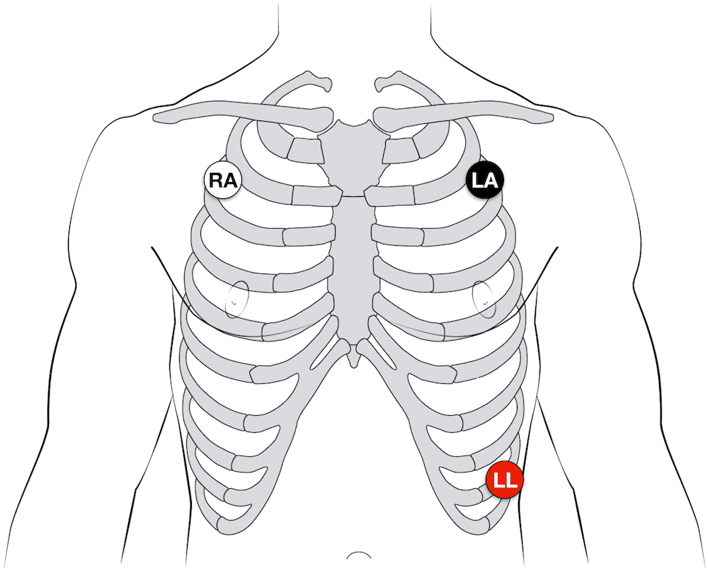

# Wireless ECG Monitor - Heart Health

This was a project for my wireless networks course, our goal was to develop the hardware and software to record an electrocardiogram, store and perform analysis with the data, and return the results to the users smartphone and our website.

## Hardware Setup

 
<ul>
  <li>AD8232 Single Lead Heart Rate Monitor</li>
  <ul>
  <li>The AD8232 is an integrated signal conditioning block for ECG and other biopotential measurement applications. It is designed to extract and filter small biopotential signals in the presence of noisy conditions, such as those created by motion or remote electrode placement.</li>
  
  </ul>
  <li>Elegoo Uno
  <ul>
   <li>Interfacing AD8232 ECG sensor with Arduino to process the serial data and transmit it to the RPi</li>
  <li>Here we connected the 3.3v & GND for sensor to 3.3v &GND of Arduino respectively, OUTPUT pin of sensor to A0 of Arduino and Finally LO- & LO+ are connected to 11 & 10 respectively.
    </li>
    
  </ul>
  <li>Raspberry Pi 3B</li>
   <ul>
  <li>Interfacing with the Arduino Uno to handle serial data and transmit data to our SQL database and website backend.</li>
  </ul>
   
</ul>
Our ECG Wireless Monitoring system is hooked up to the patient using three electrodes which are attached to the body (preferably chest).   These are responsible for capturing the electric signals created by contractions in the heart. Once the electrodes are attached, an analog signal is sent to the AD8232 ECG Sensor. The AD8232 is an integrated signal conditioning block for measuring electrocardiograms and other biopotential measurement applications. It is designed to extract, amplify, and filter small biopotential signals in the presence of noisy conditions, such as those created by motion or remote electrode placement. In layman terms, it converts the analog data into digital.
The digital data is then processed by an Arduino Uno through the Arduino IDE. The Arduino does some minor signal filtering and removes excess noise, processes and sends the data through the serial port to the Raspberry Pi. Our python script is executed on the Raspberry Pi and interacts with the Arduino directly via physical serial port connection. The python script reads and stores the data from the serial port (Arduino) and plots the serial data on a graph. This is implemeneted using SciPy to identify the pattern in the serial data and is then plotted using Matplotlib. 
 
<strong>Further analysis</strong> is done to approximate the individual heart beats per minute, this data and the direct digital readings (serial data), and graph of the electrocardiogram is stored on an SQL database and hosted on our frontend. Additionally all recorded measurements and data (graphs) are sent to our web server hosted on the Pi, as well as forwarded to the users email. Below is a video demo of the wireless monitor being used and the data being transmitted.
<h4><a href="https://youtu.be/AaQjDbL4wHc" style="bold">Video Demo</a></h4>
